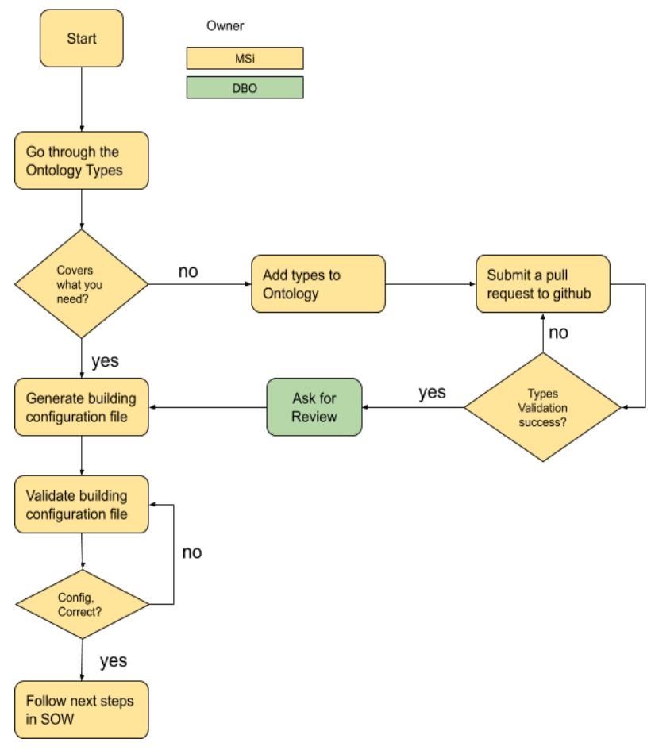
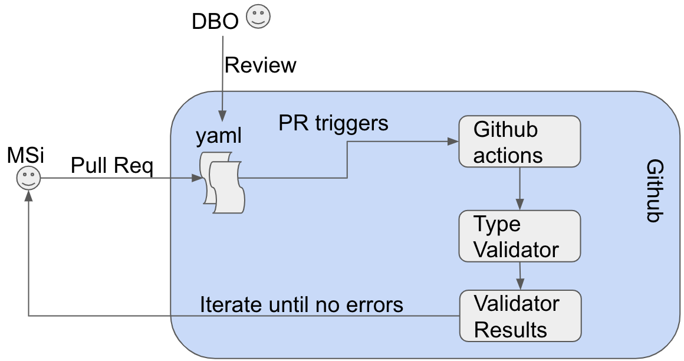

# Process Overview

An overview of the process is depicted in the figure below.




Start by going through the existent ontology types [[yaml]](./../yaml).

If the types covers what you need to model, then you may skip to the [Building Configuration part](#building-configuration). 

Otherwise, follow the next [step](#ontology-types-extension).

## Ontology Types Extension

The overall steps for the ontology extension are depicted in the figure below.




To extend the Ontology with new entity types, fields, or other. 
You are required to propose such extensions in yaml files and submit a pull request.

* Upon each pull request, the Ontology Types Validator [link](https://github.com/google/digitalbuildings/tree/master/tools/validators/ontology_validator) is triggered by a github action.
  For example,the following pull request shows that some types are not valid.
) as shown in the figure below (please expand to see the detailed error message: : [https://github.com/google/digitalbuildings/pull/62/checks?check_run_id=920485160
](https://github.com/google/digitalbuildings/pull/62/checks?check_run_id=920485160)


* Iterate through until the validation is successful.

* Ask for a review from the Digital Buildings Ontology team.

## Building Configuration

The Building configuration is a yaml file containing various information about the building, as detailed [[link]](https://github.com/google/digitalbuildings/blob/master/ontology/docs/building_config.md)

You may generate the building configuration file in yaml using the method of your choice.

### Validating Building Config
The ontology instance validator allows to make sure that the building configuration file is consistent with the ontology types.

#### Case: No changes to the ontology types
In the case of no change has been done to the ontology types or if the changes are merged in the digitalbuildings master branch, you can apply the following to test your generated building config:

* Install the required dependencies using the setup.py file from the following repo: [[link]](https://github.com/google/digitalbuildings/tools/validators/instance_validator) and run `python3 setup.py install`
* Run the following command to validate the building configuration:
```
python3 instance_validator.py --input path/to/YOUR_BUILDING_CONFIG.yaml
``` 

#### Case: Changes to the ontology types
In the case of changes to the ontology types and they are not merged in the master branch. 

You need to point the Instance Validator to the newly added types by applying the following command:
``` 
python3 instance_validator.py --input path/to/YOUR_BUILDING_CONFIG.yaml --modified-ontology-types path/to/modified/ontology/types/folder
```
Note: as of the current development stage, you must clone the entire repository and run this instance validator script from this directory.
 
* Iterate until the instance validator passes.

* Once the building configuration file is valid, please follow the instructions in the SOW.
